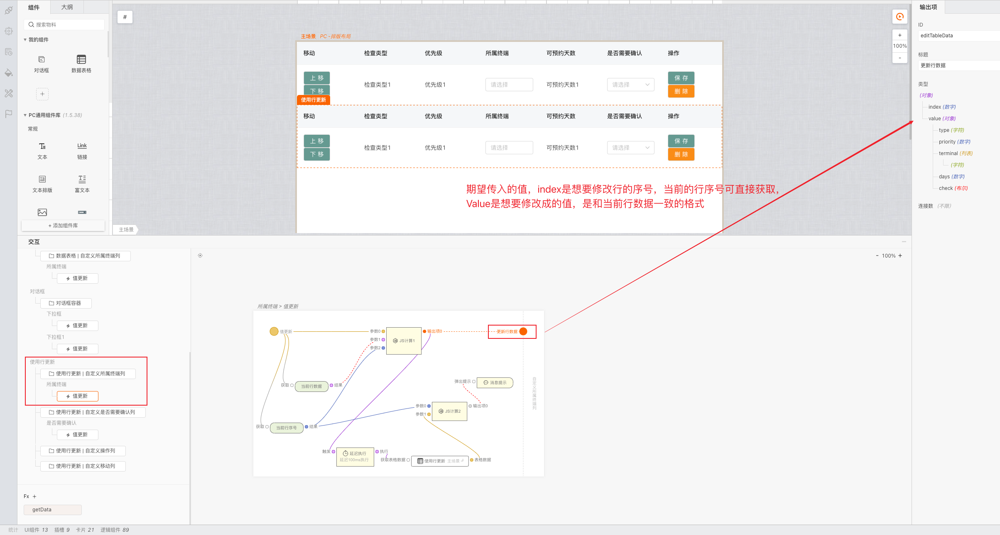
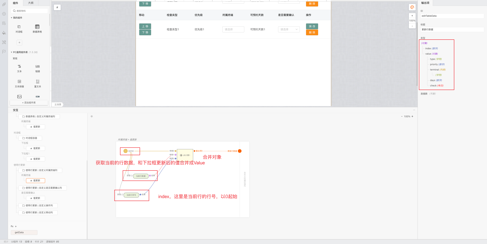
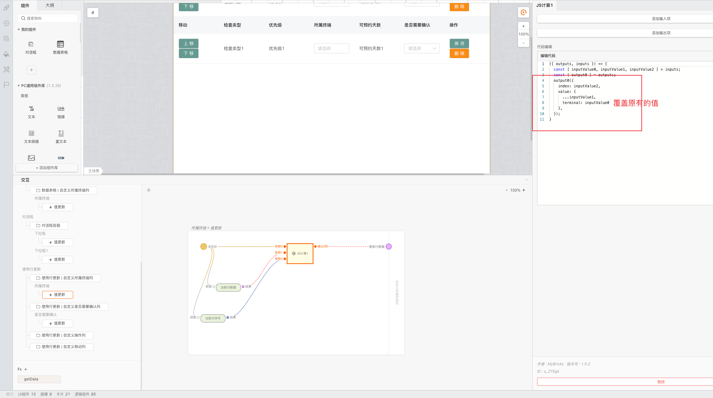

## 功能说明

不再需要按以前思路用变量存储表格数据再进行CURD，简化了搭建

## 功能概览

- 原有方案：使用全局变量存储数据，需要更新数据时就更新全局变量再触发表格更新
- 行数据更新：组合好想要更新的行序号、行数据再连线传递即可
- 比较：更加方便简洁，但是可能需要熟悉数据的结构
*重点是以下图片中JS计算1部分*


## 使用方法介绍

1. 拖入数据表格并新增列，配置改列的类型为自定义插槽，聚焦到对应交互卡片，右侧会有一个更新行数据

2. 给这一列的插槽放入一个下拉框（按照你的实际需求放即可），再给数据表格置数据源，并给下拉框设置数据源和初始值

3. 使用行数据更新
给下拉框添加一个值更新的响应事件（聚焦下拉框，右侧编辑中事件，点击值更新事件的新建）
  
按照提示组合成预期数据（可以使用JS计算和对象取值），然后连线即可，此时第index+1行会替换成传入的value值。
index可以使用获取行序号，value值可以使用获取行数据并修改其中想要修改的字段。



```js
// 预期的数据格式
{
 index: number, //数字,需要修改的行的序号,以0为起始,和右键中获取当前行序号一致
  value: object, //对象,想要修改成的这一行的数据,格式和当前行数据一致
}

// 栗子
// 当前行数据
{
  type: 字符
  priority: 数字
  terminal: 任意列表
  days: 字符
  check: 布尔
}
// 预期的 更新行数据的输入
{
  index: 数字,
  value: {
   type: 字符
   priority: 数字
   terminal: 任意列表
   days: 字符
   check: 布尔
  }
}
```

组合数据

4. 效果，添加一个提示气泡，点击调试，修改下拉框值，发现数据表格值已经修改，符合预期。
